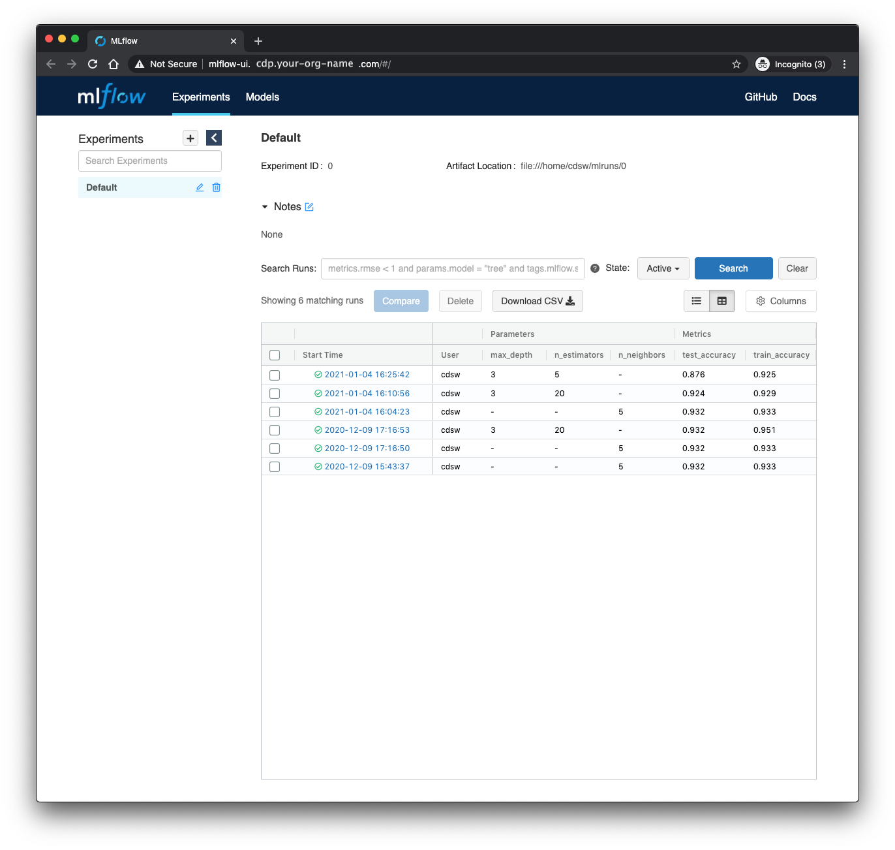

# MLflow for experiment tracking

[MLflow](https://www.mlflow.org/) self describes as

> an open source platform to manage the ML lifecycle, including experimentation, reproducibility, deployment, and a central model registry.

In particular MLflow's experiment tracking capabilities offer a low-friction way of tracking model hyperparameters and metrics across many experiments.
This repository demonstrates the use of MLflow tracking in a couple of simple machine learning model training scripts inside Cloudera Machine Learning (CML) and Cloudera Data Science Workbench (CDSW).
(We will refer only to CML in the remainder of this README, but the code should function equally well in either CML or CDSW).
The repository is intended as less a tutorial on MLflow, and more an example of running MLflow inside CML.
The AMP does not cover the model registry, project, or deployment capabilities of MLflow.

The rest of this README is structured as follows.

- [Repository structure](#repository-structure).
  A brief orientation to the structure of this repository.
- [Running training scripts](#running-training-scripts).
  Instructions and setup for running model training and testing, logging experimental results with MLflow.
- [Viewing the MLflow UI](#viewing-the-mlflow-ui).
  Using the MLflow UI to view the training logs.
- [Deploying a model as a CML API endpoint](#deploying-a-model-as-a-cml-api-endpoint).
  How to serve a trained model as a REST endpoint using CML Models.

## Repository structure

The folder structure of this repo is as follows

```
.
├── cml       # This folder contains scripts that facilitate the project launch on CML
└── scripts   # Our analysis code
```

When the training scripts have been run (this will happen on project launch if using the CML Applied ML Prototype interface), an additional `mlruns` directory will appear for use by MLflow.
This can be redirected to another location (HDFS, for instance)

### cml

These scripts are specific to Cloudera Machine Learning, and, with the `.project-metadata.yaml` file in the root directory, allow the project to be deployed automatically, following a declarative specification for jobs, model endpoints and applications.

```
cml
├── install_dependencies.py # Script to run pip install of Python dependencies
└── mlflow_ui.py            # Script to launch MLflow ui application.
```

### cdsw-build.sh

This script is executed automatically by CML whenever a Model build is triggered.
It installs the project's Python dependencies into the model container image.

### scripts

This is where all our analysis code lives.
In a more involved analysis, we could replace these scripts with jupyter notebooks to run manually, or abstract some re-usable code into a Python libary.

```
scripts
├── data.py                 # create fake train and test data
├── model_api.py            # CML Model entrypoint (predict function)
├── train_kneighbors.py     # train a k-nearest neighbors classifier
├── train_random_forest.py  # train a random forest classifier
└── train_sweep.py          # GridSearchCV hyperparameter sweep for either model
```

### app.py

A Streamlit application that lets you query a deployed CML Model endpoint interactively.
It reads the model URL and access key from the environment variables `CML_MODEL_PREDICT_URL` and `CML_MODEL_ACCESS_KEY`, which can also be overridden at runtime in the sidebar.

## Launching

There are three ways to launch this project on CML:

1. **From Prototype Catalog** - Navigate to the Prototype Catalog on a CML workspace, select the "MLflow Tracking" tile, click "Launch as Project", click "Configure Project"
2. **As ML Prototype** - In a CML workspace, click "New Project", add a Project Name, select "ML Prototype" as the Initial Setup option, copy in the [repo URL](https://github.com/cloudera/CML_AMP_MLflow_Tracking.git), click "Create Project", click "Configure Project"
3. **Manual Setup** - In a CML workspace, click "New Project", add a Project Name, select "Git" as the Initial Setup option, copy in the [repo URL](https://github.com/cloudera/CML_AMP_MLflow_Tracking.git), click "Create Project". Launch a Python3 Workbench Session with at least 2GB of memory and 1vCPU. Then follow the instructions below, in order.

## Running training scripts

If this repo is imported as an Applied Machine Learning Prototype in CML, the launch process should handle all the setup for you, and you can skip the Installation step.
In case you want to run through it manually, follow the instructions in the Installation section below.

### Installation

The code was developed against Python 3.13.
Inside a CML Python 3 session, simply run

```
!pip3 install -r requirements.txt
```

> **Note:** Cloudera AI pre-installs MLflow 2.19.0 in all sessions — it is not listed in `requirements.txt` and does not need to be installed separately. See the [Cloudera AI experiment tracking docs](https://docs.cloudera.com/machine-learning/1.5.5/experiments/topics/ml-exp-v2-tracking.html) for details.

In order for Python to pick up the `scripts` directory when running from the command line (see below), we must set an environment variable for the project, setting the `PYTHONPATH` to the root directory of the project.
Unless you have specifically cloned the project into a different location, this will be `/home/cdsw`.
See the [instructions for setting project-level environment variables in CML](https://docs.cloudera.com/machine-learning/cloud/engines/topics/ml-environment-variables.html).
Alternately, type `export PYTHONPATH=/home/cdsw` in a session terminal.


### Training

Inside the `scripts/` directory are three scripts, as described above.
The `data.py` script creates a fake dataset for a supervised classification problem.
When working with genuine business data, we'd probably be reading this data from a database or flat file storage.

There are two training scripts.

- `train_kneighbors.py` trains a k-nearest neighbors algorithm, where the number of neighbors to consider is provided as a command line argument.
- `train_random_forest.py` trains a random forest, and we expose two hyperparameters&mdash;the maximum tree depth and number of trees&mdash;as command line arguments.

Each script is instrumented with MLflow to log the hyperparameters used and the accuracy of the trained model on a train and test set.

Both training scripts call `mlflow.sklearn.autolog(log_models=False)` before training, which automatically captures all sklearn pipeline hyperparameters and training metrics without explicit `log_param` calls ([Cloudera AI Automatic Logging docs](https://docs.cloudera.com/machine-learning/1.5.5/experiments/topics/ml-exp-v2-auto-logging.html)).
Test-set accuracy is logged explicitly since autolog only observes the `fit()` call.
Each run also registers the trained model in the **CML Model Registry** via the `registered_model_name` argument on `log_model()`, creating a new version on every run.

To train the k-nearest neighbors model, start a CML session and run `!python3 scripts/train_kneighbors.py` in the session Python prompt, or without the bang (`!`) in the session terminal.
This will train the model with the default (5) nearest neighbors.
To run with a different number of neighbors, pass a command line argument like so:

```bash
!python3 scripts/train_kneighbors.py --n-neighbors 3
```

If the code was imported as an Applied Machine Learning Prototype, the declarative project will have set up a job for each training script, and executed each once, using the default hyperparameters.
Feel free to run the scripts some additional times, passing different hyperparameters.
This can be done in any of three ways:

1. By re-running the jobs after changing the default hyperparameter values in the script.
2. Interactively in a Python session.
3. At the command line in a session terminal, as described above.

## Hyperparameter sweep

`scripts/train_sweep.py` runs an automated search over a predefined grid of hyperparameter values using sklearn's `GridSearchCV`.
Instead of training once with fixed values, it tests every combination, picks the best result via k-fold cross-validation, and logs only the winner to MLflow.

Run it from a session terminal:

```bash
# Sweep KNN (default)
!python3 scripts/train_sweep.py --model knn --cv 5

# Sweep Random Forest
!python3 scripts/train_sweep.py --model rf --cv 5
```

The hyperparameter grids are defined at the top of `train_sweep.py` and are easy to extend.
After a sweep, the best model is automatically registered in the CML Model Registry under the same name used by the single-run training scripts (`kneighbors-classifier` or `random-forest-classifier`), so the CML Model endpoint will pick it up without any changes.

## Viewing the MLflow UI

Since our training scripts were instrumented with MLflow, the parameters, metrics, models and additional metadata associated with any training runs will have been logged in the `mlruns` directory.
We can investigate the performance metrics for each run using MLflow's UI.
The automated setup will have created a CML Application called "MLflow UI" that can be visited from the Applications tab of CML, and will look something like this.



We can now interact with the MLfLow UI as if it were running on our local machine to compare model training runs.

You can start the MLflow UI manually inside a session with

```bash
!mlflow ui --port $CDSW_READONLY_PORT --backend-store-uri ${MLFLOW_TRACKING_URI:-mlruns}
```

> **Note:** MLflow 3.x defaults to `sqlite:///mlflow.db` when no backend store is specified.
> Passing `--backend-store-uri mlruns` (or your `MLFLOW_TRACKING_URI`) ensures the UI reads
> the same file-based tracking store used by the training scripts.
> Use a session with at least **4 GB of memory** — the MLflow 3.x server uses uvicorn and
> requires more RAM than older versions. A status 137 exit (OOM kill) is the symptom when
> the session is under-resourced.

When launched from a session, the UI will be listed in the nine-dot menu in the upper right corner of the session interface.
Clicking it will open a new browser tab with the UI.
When launched in a session, the UI will block other uses of the session, and will be closed when the session closes.
It's not recommended to run two simultaneous copies of the MLflow interface (i.e. both as an Application and inside a session).

## Deploying a model as a CML API endpoint

After training, you can serve any logged model as a live REST endpoint using the CML Models feature.
The model entrypoint is `scripts/model_api.py`, and the handler function is `predict`.

### Prerequisites

- At least one completed training run (run either training job, or execute a training script manually).
- The `cdsw-build.sh` file in the project root — CML executes this script to install dependencies when building the model image.

### Step 1 — find the run ID to deploy

Open the MLflow UI (see [Viewing the MLflow UI](#viewing-the-mlflow-ui)) and click the run you want to serve.
Copy the **Run ID** from the run detail page — it looks like `a1b2c3d4e5f6...`.

Alternatively, list recent runs from a session:

```python
from mlflow.tracking import MlflowClient
client = MlflowClient()
runs = client.search_runs(experiment_ids=["0"], order_by=["start_time DESC"], max_results=5)
for r in runs:
    print(r.info.run_id, r.data.metrics)
```

### Step 2 — create the model in CML

1. In your CML project, navigate to **Models** → **New Model**.
2. Fill in the form:

   | Field | Value |
   |---|---|
   | **Name** | e.g. `mlflow-classifier` |
   | **Description** | e.g. `KNN or Random Forest trained with MLflow` |
   | **File** | `scripts/model_api.py` |
   | **Function** | `predict` |
   | **Runtime** | Python 3.13 / Standard |
   | **Kernel** | Python 3 |

3. Under **Environment Variables**, add one of the following to point the API at a model:

   | Variable | Value | Priority |
   |---|---|---|
   | `MLFLOW_MODEL_NAME` | `kneighbors-classifier` or `random-forest-classifier` | Highest — loads the latest registered version from the CML Model Registry |
   | `MLFLOW_RUN_ID` | the run ID copied in Step 1 | Used when `MLFLOW_MODEL_NAME` is not set |
   | `PYTHONPATH` | `/home/cdsw` | Always required |

   If neither `MLFLOW_MODEL_NAME` nor `MLFLOW_RUN_ID` is set, the API falls back to the most-recent run.
   Using `MLFLOW_MODEL_NAME` is recommended — it decouples the deployment from a specific run ID and always serves the latest registered version.

4. Click **Deploy Model**.
   CML will run `cdsw-build.sh` to install dependencies and then start the endpoint.

### Step 3 — call the endpoint

Once the model status shows **Deployed**, grab the **Access Key** from the model's detail page and call the endpoint:

```bash
curl -X POST https://<your-cml-host>/api/v1/projects/<project-id>/models/<model-id>/predict \
  -H "Content-Type: application/json" \
  -d '{
    "accessKey": "<your-access-key>",
    "request": {
      "features": [0.1, -0.5, 1.2, 0.0, 0.3, -1.1, 0.8, 0.2, -0.4, 0.6,
                   0.9, -0.2, 1.5, -0.7, 0.4, 0.1, -0.3, 0.8, -0.9, 0.5]
    }
  }'
```

The response will look like:

```json
{
  "prediction": 1,
  "probabilities": [0.23, 0.77],
  "run_id": "a1b2c3d4e5f6..."
}
```

The `features` array must contain exactly **20 numeric values**, matching the 20-feature dataset generated by `scripts/data.py`.

### Updating the deployed model

To swap in a different run (e.g. after retraining with new hyperparameters):

1. Navigate to the model in CML → **Builds** → **New Build**.
2. Update the `MLFLOW_RUN_ID` environment variable to the new run ID.
3. Deploy the new build — CML will keep the old build live until the new one is ready.

## Classifier Demo application

`app.py` is a Streamlit application that provides a point-and-click UI for querying the deployed model.

### Launching the demo app

The automated project setup (AMP) will start the **Classifier Demo** application automatically under the `classifier-demo` subdomain.

To launch it manually:

1. In your CML project, go to **Applications** → **New Application**.
2. Fill in the form:

   | Field | Value |
   |---|---|
   | **Name** | `Classifier Demo` |
   | **Subdomain** | `classifier-demo` |
   | **Script** | `cml/app.py` |
   | **Runtime** | Python 3.13 / Standard |

3. Add the following environment variables to the application:

   | Variable | Value |
   |---|---|
   | `CML_MODEL_PREDICT_URL` | The predict URL from your deployed CML Model |
   | `CML_MODEL_ACCESS_KEY` | The access key from your deployed CML Model |

4. Click **Launch Application**.

### Using the demo

- The sidebar shows the current model connection status.
  If `CML_MODEL_PREDICT_URL` and `CML_MODEL_ACCESS_KEY` were set as environment variables they will be pre-populated; you can also paste them directly into the sidebar fields at any time.
- Click **🎲 Randomize** to generate a random 20-feature vector, or edit the JSON array manually.
- Click **▶ Predict** to send the features to the model and see the predicted class, class probabilities, and the MLflow run ID that produced the model.
